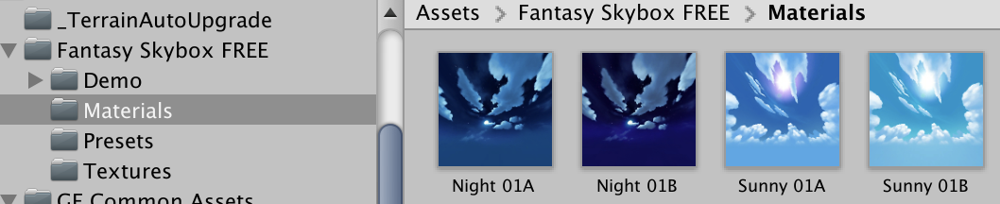
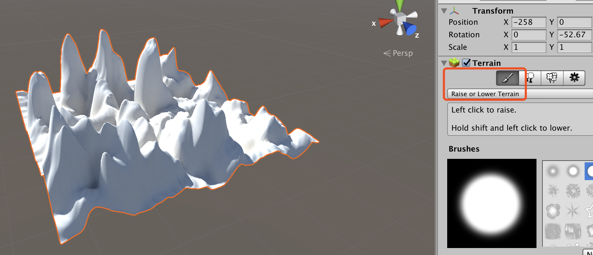
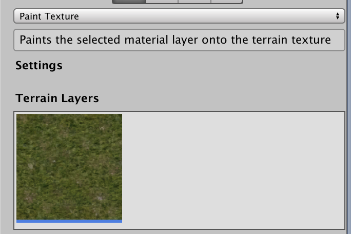
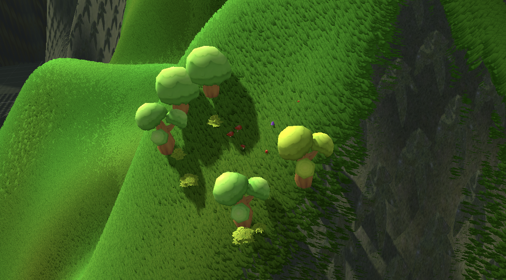
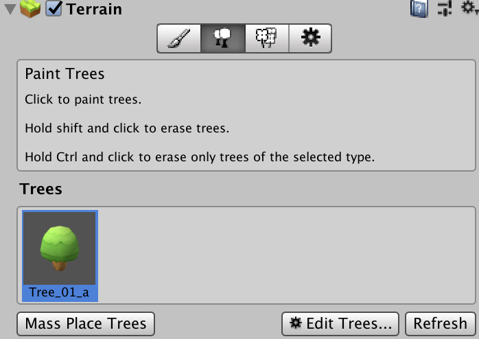
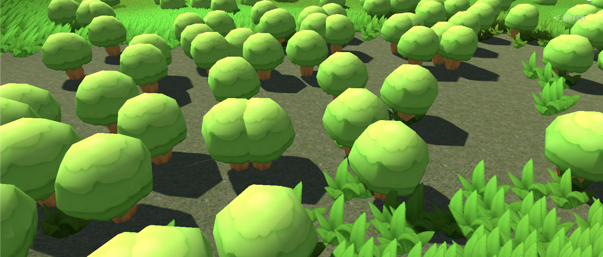
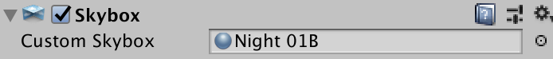
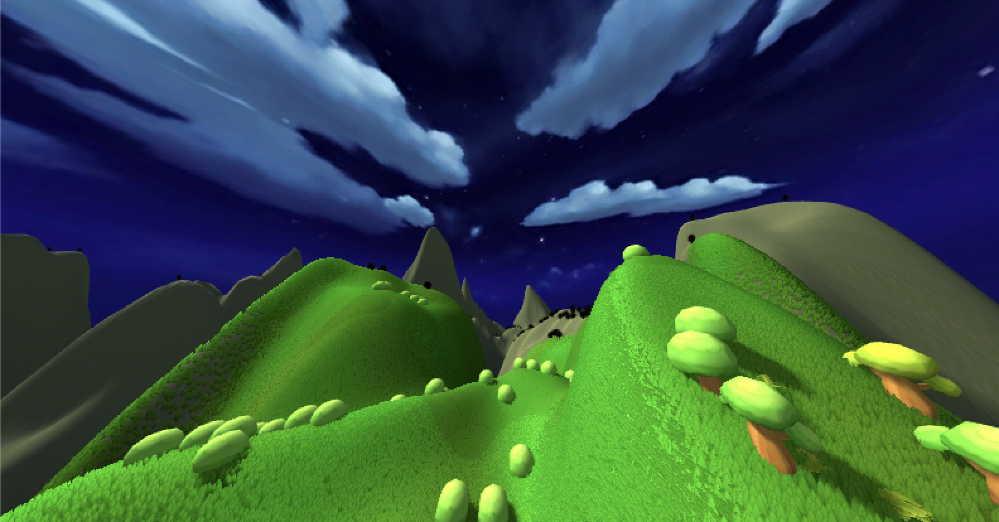
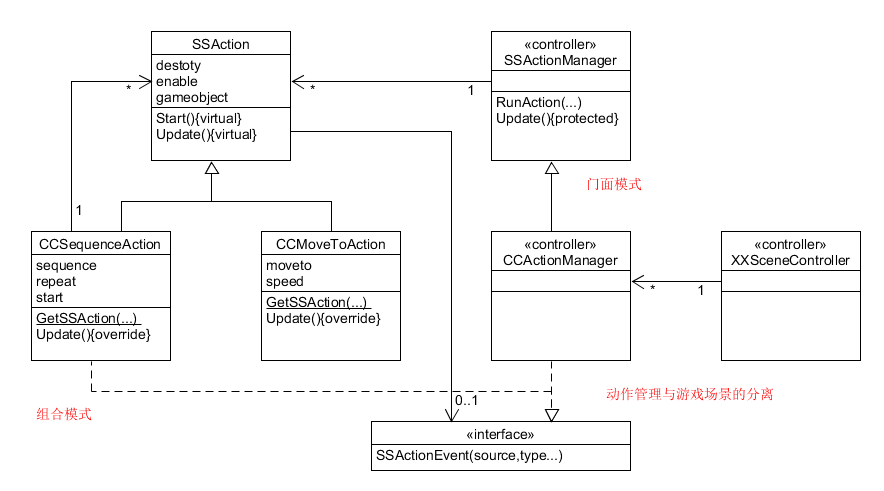
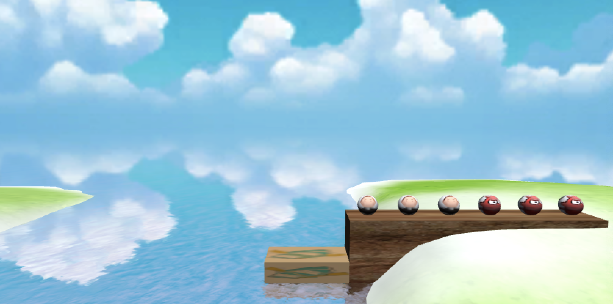

1. 基本操作演练

   - 下载 Fantasy Skybox FREE， 构建自己的游戏场景

     在Assert Store搜索Fantasy Skybox FREE并下载，下好之后import进项目中。

     

     Fantasy Skybox FREE中提供了四种天空，以及一些花草、地形的Demo。

     

     首先创建一个地形，我这个地形应该是群山。

     

     接下来给山上种上草，首先用layer，再用细节画笔画上小草，然后将预置中的小树蘑菇以及树丛种一些上去。

     

     

     在添加树木时，可以用树木工具，Mass Place Trees，一次性添加很多树。

     

     效果如图，地上种了很多很多树。

     

     接下来给摄像机添加Skybox组件，我选择了一个晚上的，使用的是下载的素材。

     

     最终效果如下，说实话我觉得自己原创很难而且真的很丑，可以直接用已有的素材能稍微好看一点。

     

   - 写一个简单的总结，总结游戏对象的使用

     游戏对象的使用，我觉得能有现成的素材就多用，比如小人、小车这种，没有必要从零开始，可以对已有素材进行改造（我觉得就算完全原创的游戏也不可能完全是从Cube和Sphere开始的。另外我觉得对于相机的使用还是比较复杂需要花一番心思研究的，我觉得我的相机拍出来的东西总是很奇怪。然后应该搞懂每个游戏对象的参数都是什么意思。最后就是多学习吧，想要达到什么样的效果，就直接上网搜关键字，很多教程都写的非常好，学到了就是自己的东西了呢。
   
2. 编程实践

   - 牧师与魔鬼 动作分离版

     - 【2019新要求】：设计一个裁判类，当游戏达到结束条件时，通知场景控制器游戏结束

     按照课程中动作管理器的设计来设计游戏。因为游戏场景中的对象都有自己的action，但是实际上这些action的操作有很多重复的地方，比如牧师和魔鬼有相同的移动方式，船也有move的方法。将这些动作分离出来，可以很有效的节约资源，避免代码过多重复使用。

     

     用动作管理器可以管理场景中的所有动作，每一个场景管理器都可以有一个动作管理器，可以给对象添加或清除已完成的动作。

     ##### SSActionEvent

     这个类的作用是监听动作事件，实现这个类，就可以对事件作出反应。

     ```c#
     public interface ActionCallBack {
         void SSActionEventSSAction source);
     }
     ```

     ##### SSAction

     这个类是其他动作类的基类，定义了动作的对象以及对于动作的反应。其他动作类都继承这个类，实现具体某个object做什么样的事情。这个类继承自ScriptableObject，可以用它关于生命周期的方法。

     ```c#
     public bool enable = true;
     public bool destroy = false;
     public GameObject gameObject;
     public ActionCallBack whoToNotify;
     
     public virtual void Start() {
         throw new System.NotImplementedException();
     }
     public virtual void Update() {
         throw new System.NotImplementedException();
     }
     ```

     ##### CCMoveToAction

     这个函数可以用来控制物体的移动，有两个属性，一个是移动目标，另一个是移动速度。`GetSSAction`用来创建一个action，然后update中对它进行位置变换，当移动结束后就destroy掉这个动作。

     ```c#
     public class CCMoveToAction : SSAction
     {
         public Vector3 target;
         public float speed;
     
         private CCMoveToAction(){}
         public static CCMoveToAction GetSSAction(Vector3 target, float speed) {
             CCMoveToAction action = ScriptableObject.CreateInstance<CCMoveToAction>();
             action.target = target;
             action.speed = speed;
             return action;
         }
     		public override void Update() {
         		this.transform.position = Vector3.MoveTowards(this.transform.position, target, speed*Time.deltaTime);
         		if (this.transform.position == target) {
         				this.destroy = true;
             		this.whoToNotify.actionDone(this);
             }
         }
     		public override void Start() {
                //
        	}
     }
     ```

     ##### CCSequenceAction

     这是一个组合运动的类，动作会按顺序进行，当前一个运动完成之后，callback会通知下一个动作对象（也就是自己）来完成下一个动作，其中还有repeat的参数，可以让动作循环进行。

     在这个游戏中就是先到中点再到目的地，连起来动。
     
     ```c#
     public class CCSequenceAction: SSAction, ActionCallBack {
         public List<SSAction> sequence;
         public int repeat = 1; // 1->only do it for once, -1->repeat forever
         public int currentActionIndex = 0;
     
         public static CCSequenceAction getAction(int repeat, int currentActionIndex, List<SSAction> sequence) {
         		CCSequenceAction action = ScriptableObject.CreateInstance<CCSequenceAction>();
             action.sequence = sequence;
             action.repeat = repeat;
             action.currentActionIndex = currentActionIndex;
             return action;
         }
     		public override void Update() {
             if (sequence.Count == 0)return;
             if (currentActionIndex < sequence.Count) {
                 sequence[currentActionIndex].Update();
             }
        }
     
        public void SSActionEvent(SSAction source) {
            	source.destroy = false;
             this.currentActionIndex++;
             if (this.currentActionIndex >= sequence.Count) {
                 this.currentActionIndex = 0;
                 if (repeat > 0) repeat--;
                 if (repeat == 0) {
                     this.destroy = true;
                     this.whoToNotify.SSActionEvent(this);
                 }
             }
         }
     
         public override void Start() {
             foreach(SSAction action in sequence) {
                 action.gameObject = this.gameObject;
                 action.transform = this.transform;
                 action.whoToNotify = this;
                 action.Start();
             }
         }
     
         void OnDestroy() {
             foreach(SSAction action in sequence) {
                 DestroyObject(action);
                     //action.destroy;
             }
         }
}
     ```
     
     #####SSActionManager
     
     负责对游戏对象执行动作，并销毁标记为destroy的动作，一个动作只有添加了这个类才会真正被执行。
     
     ```c#
     public class ActionManager: MonoBehaviour, ActionCallBack {
         private Dictionary<int, SSAction> actions = new Dictionary<int, SSAction>();
         private List<SSAction> waitingToAdd = new List<SSAction>();
         private List<int> watingToDelete = new List<int>();
     
         protected void Update() {
             foreach(SSAction ac in waitingToAdd) {
                 actions[ac.GetInstanceID()] = ac;
             }
             waitingToAdd.Clear();
     
             foreach(KeyValuePair<int, SSAction> kv in actions) {
                 SSAction ac = kv.Value;
                 if (ac.destroy) {
                     watingToDelete.Add(ac.GetInstanceID());
                 } else if (ac.enable) {
                     ac.Update();
                 }
             }
     
             foreach(int key in watingToDelete) {
                 SSAction ac = actions[key];
                 actions.Remove(key);
                 DestroyObject(ac);
             }
             watingToDelete.Clear();
         }
     
         public void addAction(GameObject gameObject, SSAction action, ActionCallBack whoToNotify) {
             action.gameObject = gameObject;
             action.transform = gameObject.transform;
             action.whoToNotify = whoToNotify;
             waitingToAdd.Add(action);
             action.Start();
         }
     
         public void SSActionEvent(SSAction source) {
         }
     }
     ```
     
     ##### FirstSenceActionController
     
     最后一个类就是针对firstsence的动作管理类。通过它来管理firstsence。
     
     ```c#
     public class FirstSceneActionManager:CCActionManager {
     		public void moveBoat(BoatController boat) {
     		CCMoveToAction action = CCMoveToAction.getSSAction(boat.getDestination(), boat.movingSpeed);
     		this.addAction(boat.getGameobj(), action, this);
     }
     
     public void moveCharacter(MyCharacterController characterCtrl, Vector3 destination) {
     		Vector3 currentPos = characterCtrl.getPos();
     		Vector3 middlePos = currentPos;
     		if (destination.y > currentPos.y) {		//from low(boat) to high(coast)
     				middlePos.y = destination.y;
     		} else {	//from high(coast) to low(boat)
     				middlePos.x = destination.x;
     		}
     		SSAction action1 = CCMoveToAction.getSSAction(middlePos, characterCtrl.movingSpeed);
     		SSAction action2 = CCMoveToAction.getSSAction(destination, characterCtrl.movingSpeed);
     		SSAction seqAction = CCSequenceAction.getSSAction(1, 0, new List<SSAction>{action1, action2});
     		this.addAction(characterCtrl.getGameobj(), seqAction, this);
         }
     }
     ```
     
     ##### FirstController
     
     在firstcontroller中，首先会获取FirstSceneActionManager。
     
     ```c#
     void Start() {
         actionManager = GetComponent<FirstSceneActionManager>();
     }
     ```
     
     并且在运动时使用actionmanager中封装好的方法。
     
     ```c#
     actionManager.moveCharacter(characterCtrl, boat.getEmptyPosition());
     actionManager.moveCharacter(characterCtrl, whichCoast.getEmptyPosition ());
     ```
     
     这样只需要一个FirstSceneActionManager和一个空对象，就可以控制所有物体的运动，不需要给每一个object都写自己的运动函数了。
     
     ##### Judger
     
     这个类是一个裁判类，原本判断游戏是否结束是在firstsence中，现在我们它分离出来。其实实现的方法还是原来的方法，只是结构不同了。
     
     ```c#
     public class Judger : MonoBehaviour {
     	public int check_game_over(CoastController fromCoast, CoastController toCoast, BoatController boat) {	// 0->not finish, 1->lose, 2->win
     		int from_priest = 0;
     		int from_devil = 0;
     		int to_priest = 0;
     		int to_devil = 0;
     
     		int[] fromCount = fromCoast.getCharacterNum ();
     		from_priest += fromCount[0];
     		from_devil += fromCount[1];
     
     		int[] toCount = toCoast.getCharacterNum ();
     		to_priest += toCount[0];
     		to_devil += toCount[1];
     
     		if (to_priest + to_devil == 6)		// win
     			return 2;
     
     		int[] boatCount = boat.getCharacterNum ();
     		if (boat.get_to_or_from () == -1) {	// boat at toCoast
     			to_priest += boatCount[0];
     			to_devil += boatCount[1];
     		} else {	// boat at fromCoast
     			from_priest += boatCount[0];
     			from_devil += boatCount[1];
     		}
     		if (from_priest < from_devil && from_priest > 0) {		// lose
     			return 1;
     		}
     		if (to_priest < to_devil && to_priest > 0) {
     			return 1;
     		}
     		return 0;			// not finish
     	}
     }
     ```
     
     使用的时候首先要初始化一个judger。
     
     ```c#
     judger = new Judger();
     ```
     
     然后在场景控制器中调用它即可。
     
     ```c#
     userGUI.status = judger.check_game_over(fromCoast,toCoast,boat);
     ```
     
     ##### attachCamera
     
     添加一个跟随对象的照相机。这个相机可以根着船移动，并添加一个天空盒。
     
     ```c#
     private void attachCamera() {
     		cameraObj = new GameObject("Camera_follow");	// 新建一个空对象叫做Camera_follow
     		cameraObj.transform.parent = boat.transform;	// 先让这个对象成为boat的子对象
     			// 调整一下Camera_follow与boat的相对方位
     		cameraObj.transform.localPosition = new Vector3(0, 7, -8);
     		cameraObj.transform.localRotation = Quaternion.Euler(5, 0, 0);
     
     		cameraObj.AddComponent<Camera>();	// 添加Camera组件，让这个空对象成为一个摄像机
     		Camera cameraComp = cameraObj.GetComponent<Camera>();	// 获取摄像机组件
     		cameraComp.fieldOfView = 50;
     
     			// 将Resources/skybox添加为这个摄像机的天空盒
     		cameraObj.AddComponent<Skybox>().material = Resources.Load("skybox") as Material;
     }
     ```
     
     最终的游戏场景，参考了前辈的项目。蓝天白云青青草地。一片温馨和睦。
     
     
     
     视频地址


项目仓库  [参考博客](https://www.jianshu.com/p/df7290dfc36b)